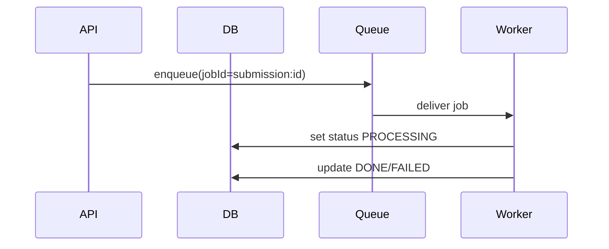

# Concurrency Control

```mermaid
sequenceDiagram
  participant API
  participant DB
  participant Queue
  participant Worker

  API->>Queue: enqueue(jobId=submission:id)
  Queue->>Worker: deliver job
  Worker->>DB: set status PROCESSING
  Worker->>DB: update DONE/FAILED
```
