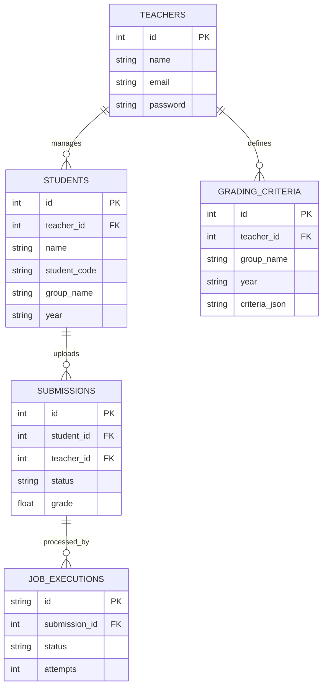

# Database ER Diagram

```mermaid
erDiagram
  TEACHERS ||--o{ STUDENTS : manages
  TEACHERS ||--o{ GRADING_CRITERIA : defines
  STUDENTS ||--o{ SUBMISSIONS : uploads
  SUBMISSIONS ||--o{ JOB_EXECUTIONS : processed_by

  TEACHERS {
    int id PK
    string name
    string email
    string password
  }
  STUDENTS {
    int id PK
    int teacher_id FK
    string name
    string student_code
    string group_name
    string year
  }
  SUBMISSIONS {
    int id PK
    int student_id FK
    int teacher_id FK
    string status
    float grade
  }
  GRADING_CRITERIA {
    int id PK
    int teacher_id FK
    string group_name
    string year
    string criteria_json
  }
  JOB_EXECUTIONS {
    string id PK
    int submission_id FK
    string status
    int attempts
  }
```
