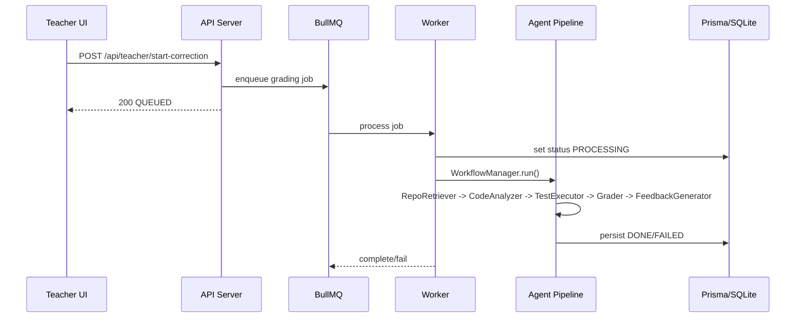

# Grading Sequence Diagram

```mermaid
sequenceDiagram
  participant T as Teacher UI
  participant API as API Server
  participant Q as BullMQ
  participant W as Worker
  participant A as Agent Pipeline
  participant DB as Prisma/SQLite

  T->>API: POST /api/teacher/start-correction
  API->>Q: enqueue grading job
  API-->>T: 200 QUEUED
  Q->>W: process job
  W->>DB: set status PROCESSING
  W->>A: WorkflowManager.run()
  A->>A: RepoRetriever -> CodeAnalyzer -> TestExecutor -> Grader -> FeedbackGenerator
  A->>DB: persist DONE/FAILED
  W-->>Q: complete/fail
```
