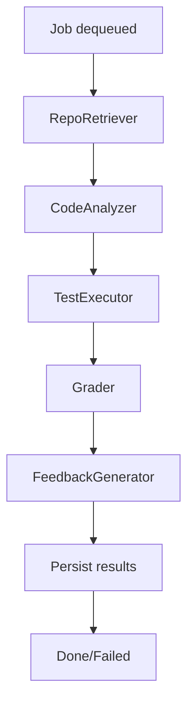

# Multi-Agent Workflow Diagram

```mermaid
flowchart TD
  A[Job dequeued] --> B[RepoRetriever]
  B --> C[CodeAnalyzer]
  C --> D[TestExecutor]
  D --> E[Grader]
  E --> F[FeedbackGenerator]
  F --> G[Persist results]
  G --> H[Done/Failed]
```
