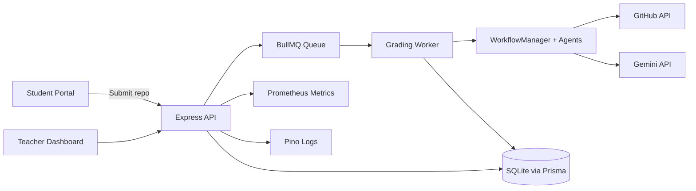

# System Diagram

```mermaid
flowchart LR
  StudentUI[Student Portal] -->|Submit repo| API[Express API]
  TeacherUI[Teacher Dashboard] --> API
  API --> Queue[BullMQ Queue]
  Queue --> Worker[Grading Worker]
  Worker --> Agents[WorkflowManager + Agents]
  Agents --> GitHub[GitHub API]
  Agents --> Gemini[Gemini API]
  Worker --> DB[(SQLite via Prisma)]
  API --> DB
  API --> Metrics[Prometheus Metrics]
  API --> Logs[Pino Logs]
```
